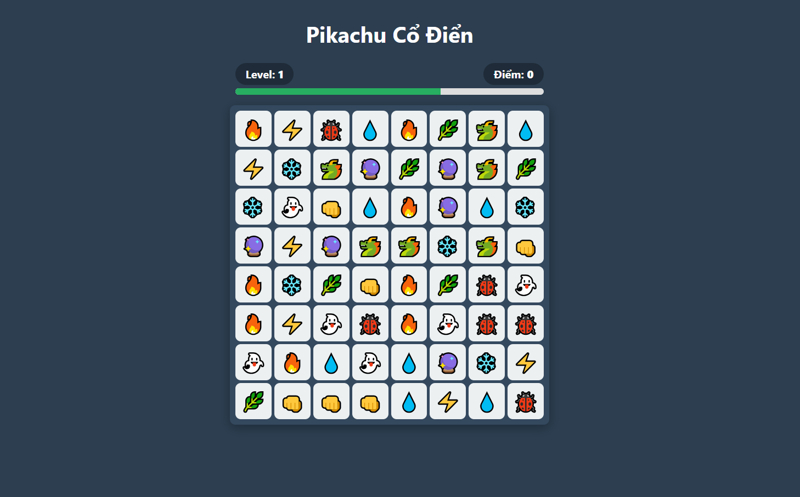
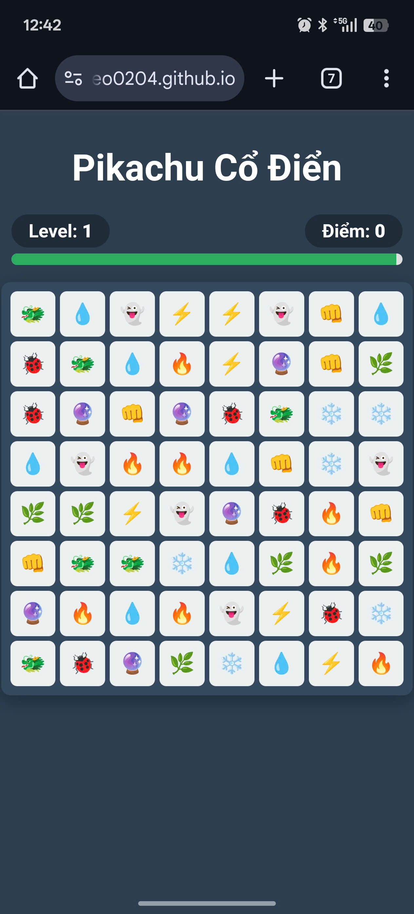

<div align="center">

# Pikachu Cổ Điển (Onet Connect)
### Vé về tuổi thơ - Phiên bản Web


<br />

> **Một tựa game huyền thoại, nay đã có thể chơi ngay trên trình duyệt điện thoại và máy tính mà không cần cài đặt!**
[👉 **CHƠI NGAY (DEMO)** 👈](https://dungameo0204.github.io/pikachuvintage/)

</div>

---

## 📸 Demo

| Giao diện PC 🖥️ | Giao diện Mobile 📱 |
| :---: | :---: |
|  |  |

## Tính năng nổi bật

* **Cross-Platform:** Chơi mượt mà trên cả PC và Điện thoại (Responsive Design).
* **Thuật toán BFS:** Tự động tìm đường đi thông minh (tối đa 3 đoạn thẳng/2 lần rẽ).
* **Hệ thống Level:** Càng lên cao thời gian càng giảm, thử thách độ nhanh tay lẹ mắt.
* **Combo:** Tính điểm và thông báo khi ăn điểm liên tục.
* **Mobile Friendly:** Tự động căn chỉnh kích thước ô cho vừa màn hình dọc.

## 🛠️ Cài đặt & Chạy Local

Game này là **Static Web** (HTML/CSS/JS thuần), không cần cài đặt phức tạp.

1.  **Clone dự án:**
    ```bash
    git clone [https://github.com/dungameo0204/pikachu-game.git](https://github.com/dungameo0204/pikachu-game.git)
    ```
2.  **Mở file:**
    Double click vào file `index.html` để chơi ngay.

## Công nghệ sử dụng

* **Core:** Vanilla JavaScript (ES6+).
* **Styling:** CSS3 (Grid Layout, Flexbox, Animation).
* **Algorithm:** Breadth-First Search (BFS) cho logic tìm đường.

---
<div align="center">
Made with ❤️ by <b>Dũng</b>
</div>